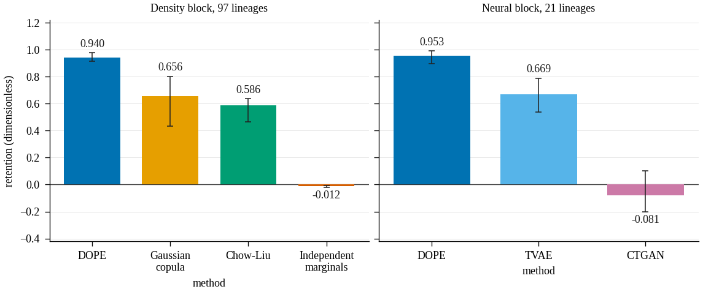

# DOPE

[](https://github.com/neverhuman/dope/actions/workflows/ci.yml)
[](docs/audit.md)

Downstream Objective-Preserving Encoding (D.O.P.E.) compiles a scaled numeric regression table into a small probabilistic program. The measurement is retention: train a regressor on synthetic rows, score it on real holdout rows, and divide by the same model's improvement over a null. The release score stays null until privacy, copy, fidelity, and representation gates all pass. This source tree is not a certified release. Version `0.3.0-alpha.1`. Licensed under the [MIT License](LICENSE).

The manuscript is [docs/whitepaper/dope-mfs.pdf](docs/whitepaper/dope-mfs.pdf). Source and receipts: https://github.com/neverhuman/dope

## The comparison

<!-- BEGIN BENCHMARK -->
CatBoost retention on 97 lineages, synthetic size 4n, fit seed 11. Each cell is a dimensionless retention.

| Comparator | n | DOPE | Other | Difference | W/T/L | Holm p |
| --- | ---: | --- | --- | --- | ---: | ---: |
| Gaussian copula | 97 | 0.940 [0.914, 0.976] | 0.656 [0.431, 0.803] | 0.224 [0.149, 0.290] | 86/0/11 | 1.35× 10^-13 |
| Chow–Liu | 97 | 0.940 [0.914, 0.976] | 0.586 [0.465, 0.637] | 0.337 [0.282, 0.451] | 94/0/3 | 4.85× 10^-16 |
| Independent marginals | 97 | 0.940 [0.914, 0.976] | -0.012 [-0.020, -0.00649] | 0.956 [0.918, 0.980] | 96/0/1 | 1.17× 10^-16 |

The linear auditor does not separate DOPE from the Gaussian copula (n=92, difference 0.00366 [-0.00438, 0.012], W/T/L 49/0/43, Holm p 0.373). That interval contains zero. MFS-v2 and MFS-v3 are null on every method in the manuscript.
<!-- END BENCHMARK -->



## Install

```bash
git clone https://github.com/neverhuman/dope.git
cd dope
cargo build --locked --release -p dope-kernel
```

That command writes `target/release/dope-kernel`.

## Try it on a small regression problem

The files in [examples/readme-regression](examples/readme-regression/) are a four-column toy with values already in `[0, 1]` and the target in the last column. `compile` reads `train.csv` only. `test.csv` is present because `certify` expects it; this example does not score it. The formula, the seed, and the row counts are in [examples/readme-regression/README.md](examples/readme-regression/README.md). This toy is not the 97-lineage result above.

```bash
target/release/dope-kernel compile \
  --dataset-dir examples/readme-regression \
  --task regression \
  --out examples/readme-regression/toy.dpk
target/release/dope-kernel inspect --kernel examples/readme-regression/toy.dpk
target/release/dope-kernel sample \
  --kernel examples/readme-regression/toy.dpk \
  --rows 200 \
  --out examples/readme-regression/synth.csv
```

`toy.dpk` and `synth.csv` stay local. Inspect of the artifact built for this page reports `artifact_bytes` 196, `rows_fitted` 400, three positional features, dependence `independence`, and target `mars`. `compliant` is false: compile sees `train.csv` only and does not certify a release. The transcript is [examples/readme-regression/INSPECT.txt](examples/readme-regression/INSPECT.txt).

## What you do not get

- Formal differential privacy.
- A HIPAA de-identification claim.
- An MFS-v2 or MFS-v3 score. Both stay null until their own gates pass.
- A license to treat the toy artifact as the 97-lineage comparison.

## Conformance

Jankurai is this repository's conformance auditor. A passing audit means the build, tests, and boundary proofs cleared the release floor with no high finding. It is not a utility score, not an MFS value, and not a privacy certificate. The gate and what the auditor checks are in [docs/audit.md](docs/audit.md).

Jankurai 1.7.1 audited `9de944ea232d3434d1e47de51fb644f9d0a89b20` on a clean tree. The report is score 86, decision pass, caps 0, high findings 0, and critical findings 0. That run also recorded two medium findings, HLT-001 and HLT-018. GitHub Actions `jankurai-audit` re-runs on the commit that adds this paragraph. The quoted score belongs to `9de944ea232d3434d1e47de51fb644f9d0a89b20`.

## Reference

Start with [AGENTS.md](AGENTS.md) for ownership and proof commands.

## Quick start

```bash
just setup
just fast
cargo build --locked --release
```

The [architecture](docs/architecture.md), [testing](docs/testing.md), and
[release](docs/release.md) guides cover product boundaries and promotion.

Public source repository: https://github.com/neverhuman/dope

```bash
git clone https://github.com/neverhuman/dope.git
cd dope
```

Licensed under the [MIT License](LICENSE). The package version remains
`0.3.0-alpha.1`; this source publication is not a certified production release.
Generated campaign output, datasets, trained router bundles, and local caches
are not included. Campaign and cluster workflows require separately prepared
inputs as described in [production/README.md](production/README.md).

The native Rust `dope-kernel` compiles compact, bounded symbolic probabilistic programs for
scaled numeric tabular datasets. V3 `.dpk` artifacts are deterministic binary
bytecode with typed schema and marginal sections plus a mutually exclusive
symbolic or neural-joint program.
They contain no source rows, column names, embedded reports, or opaque model
states. TVAE, a masked autoregressive transformer, and TabSyn latent diffusion
are genuine joint generators. Their per-channel int8 tensors, f32 scales and
activations, normalization metadata, permutations, target marginal, and
training/implementation hashes are encoded and charged to the artifact. V1 JSON artifacts
and commands remain supported as baselines.
L3 `compile`, `convert`, and `certify` expect headerless numeric CSV files with
the target in the final column and values already in `[0, 1]`. Out-of-range
values fail with normalization guidance. L3 has a hard 10,240-byte artifact
limit, L2 32,768 bytes, L1 no hard limit, and L0 is research use. A compile
may return an uncertified artifact within its limit; release requires measured
utility, structure, and empirical privacy gates. A tier or empirical privacy
result does not establish formal DP or HIPAA de-identification.

DPK3.2 uses canonical varints, fixed-point parameter ladders,
deterministic static byte-rANS sections, a versioned header, and a BLAKE3
checksum. Sections 3–5 are symbolic; section 6 is neural and cannot fall back
to a symbolic target. The decoder retains V1 JSON and V2.0/V2.1 plus V3.0/V3.1
binary compatibility. New compact neural shapes and direct-rank TabDDPM use
DPK3.3; existing full-model DPK3.2 bytes remain unchanged. JSON reports,
inspectable language dictionaries, and S-expression disassembly are sidecars
only.

The compiler fits sparse linear/logistic, GAM, GA²M, MARS, oblivious-tree, and
compact neural-residual targets and places them in the same byte/quality beam.
Independent, Chow–Liu, and bounded triangular-autoregressive dependence families
compete in that beam as well. Candidate reports identify both selected families;
encoder fitting cost is not included in the artifact byte count.

Joint training is enabled with `--features gpu-training` and requires CUDA,
libtorch 2.7, `CUBLAS_WORKSPACE_CONFIG=:4096:8`, and deterministic cuDNN
settings. Seeded libtorch work is serialized process-wide, and joint trainers
use deterministic bounded row minibatches. Micro-TVAEs use latent/hidden
widths 4/16, 8/24, and 12/32; TinyMAT profiles use widths 16 and 24.
Direct rank-space TabDDPM is a GPU research comparator eligible only for L1
certification, with no L3 size claim. Exported artifacts sample in Rust only.
The historical deep names (`ctgan`, `taegan`, `tabddpm`, and
`masked_diffusion_transformer`) remain explicit unavailable
entries. Seven `legacy_*` IDs preserve the prior symbolic-plus-neural-residual
comparators.

## Build and verify

```bash
cargo build --release
cargo test
cargo run --release --bin dope-bench

# GPU trainer build
CUBLAS_WORKSPACE_CONFIG=:4096:8 LIBTORCH_USE_PYTORCH=1 cargo build --release --features gpu-training
```

## Conversion and CLI

```bash
target/release/dope-kernel convert --dataset-dir data --real-holdout-dir data --task regression --out release
target/release/dope-kernel compile --dataset-dir data --task regression --out kernel.dpk
target/release/dope-kernel compile --dataset-dir data --task regression --language run/language.json --out kernel.dpk
target/release/dope-kernel inspect --kernel kernel.dpk
target/release/dope-kernel sample --kernel kernel.dpk --rows 1000 --out synth.csv
target/release/dope-kernel embed-dataset --csv train.csv --target-column outcome --task regression --router-bundle router.bundle.json --router-evidence router-evidence.json --out dataset-embedding.json --vector-out dataset-embedding.csv
target/release/dope-kernel compile --dataset-dir data --task regression --candidate tvae --neural-target-weight 2 --neural-structural-penalty 0.1 --out tvae.dpk
target/release/dope-kernel inventory-corpus --corpus corpus-a --corpus corpus-b --out inventory
target/release/dope-kernel pack-corpus --corpus corpus-a --corpus corpus-b --out packed
target/release/dope-kernel calibrate-language --corpus packed --out run
target/release/dope-kernel certify --real-dir data --kernel kernel.dpk --out certification.json
target/release/dope-kernel campaign freeze-deep-implementation --source-tree . --binary target/release/dope-kernel --out deep-freeze.json
target/release/dope-kernel campaign plan-deep-cohorts --training-gold training-gold.json --out deep-cohorts.json
target/release/dope-kernel campaign materialize-deep-cohort --plan deep-cohorts.json --stage confirmation --out confirmation.json
target/release/dope-kernel campaign build-deep-evidence --cohort confirmation.json --block campaign/blocks --out deep-outcomes.json
target/release/dope-kernel campaign select-deep-discovery --evidence discovery-outcomes.json --out discovery-freeze.json
target/release/dope-kernel campaign qualify-deep-confirmation --candidate tvae --evidence deep-outcomes.json --scheduled-cells 64908 --out tvae-qualification.json
target/release/dope-kernel campaign report-deep-campaign --evidence deep-outcomes.json --out deep-report.json
target/release/dope-kernel campaign select-deep-final --evidence validation-select-outcomes.json --qualification tvae-qualification.json --out winner.json
target/release/dope-kernel campaign build-deep-artifact-manifest --selection winner.json --artifact DATASET_ID=representative.dpk --representative-dataset-id DATASET_ID --out artifacts.json
target/release/dope-kernel campaign build-deep-model-card --selection winner.json --report deep-report.json --out MODEL_CARD.md

# V1 compatibility commands
dope-kernel fit --dataset-dir data --task regression --out kernel.dk.json
dope-kernel eval --real-dir data --kernel kernel.dk.json --out report.json
dope-kernel gp-search --dataset-dir data --budget-secs 10 --out best.dk.json
```

`convert` writes `kernel.dpk`, `conversion-report.json`,
`synthetic-model.bundle`, and `tstr-certification.json`. Optional
`--synthetic-seed` arguments also write reproducible synthetic CSVs. The
generator opens only `train.csv`; `test.csv` is required and opened only by the
certification evaluator.

`embed-dataset` accepts a numeric CSV with a mandatory header and exactly one
supervised target selected by name or zero-based index. Regression CSVs may be
target-only; their native sketch records zero features. It min-max normalizes
features and regression targets from that training table alone, or maps two
numeric binary labels deterministically to 0/1. The command fails closed unless
the supplied router is trained, structurally valid, linked to finite valid
evidence, has the recorded canonical bundle size, and derives the fixed 4,168
dimensions. Router promotion quality is reported separately in qualification
version 2 and does not block embedding; it continues to block campaign/release
promotion. Its version-1 vectors contain the
standardized 856-value dataset sketch followed, in router candidate order, by
each penultimate hidden state and ten standardized action predictions. Public
JSON exports use positional feature labels and omit source headers and
raw extrema. `--restricted-metadata` explicitly emits that research metadata;
restricted exports are not eligible release sidecars. These
embeddings have dimension `856 + candidates × (hidden_width + 10)` (4,168 for
24 candidates with width 128) and are action-set-specific rather than universal
similarity embeddings.
Compare them only when `schema_sha256`, `router_bundle_sha256`, and
`router_evidence_sha256` all match.

Certification evaluates `n`, `2n`, `4n`, and `8n` with three generated tables
and three auditor seeds. Gates are enforced at `n` and `4n` using unclamped
null-normalized retention, explicit low-signal non-inferiority, fidelity,
inference, and privacy checks. All six frozen auditor slots are present in the
report. Missing pinned runtimes fail closed, as do unavailable empirical or
formal-DP tournament entries; they are never represented as completed runs.

The Python package under `src/dope_kernel` remains the V1 baseline; no V3 hot
path calls Python.

The deep campaign's 108,523 discovery rows, 409,686 confirmation rows, and
11,620,492 validation-select rows are accounting totals across independent
per-dataset fits. They are not pooled into a global network. Evidence format 2
always writes one durable block per dataset matrix, including discovery
matrices below 100 cells, and cannot be reconciled with superseded receipts.

`calibrate-language` consumes only the checksummed packed manifest and writes a
restartable five-seed run directory. A language artifact is marked
`release_eligible` only when every fixed generalization and auditor gate passes;
missing pinned GPU auditor runtimes remain explicit failed gates.
