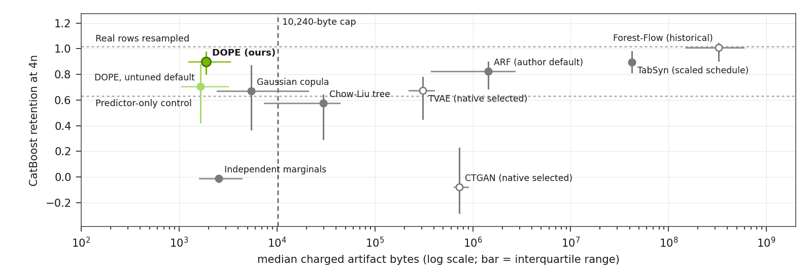
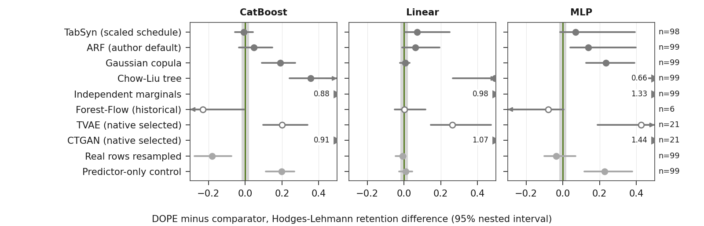

# DOPE — Downstream Objective-Preserving Encoding

[](https://github.com/neverhuman/dope/actions/workflows/ci.yml)
[](docs/audit.md)

DOPE compiles a numeric regression table into a **kilobyte-scale synthetic-data generator**: quantized per-feature marginals, a compact dependence model chosen on the training rows, a twelve-input neural residual for the target, and a noise model, all charged against a 10,240-byte cap. New rows are sampled from that artifact alone. The paper is [docs/whitepaper/dope-mfs.pdf](docs/whitepaper/dope-mfs.pdf) (supplement: [docs/whitepaper/supplement.pdf](docs/whitepaper/supplement.pdf)).

Version `0.3.0-alpha.1`, [MIT License](LICENSE). This source tree is a research release, not a certified production release. Start with [AGENTS.md](AGENTS.md) for ownership and proof commands.

## Results at a glance

<!-- BEGIN BENCHMARK -->
Validation panel: 100 PMLB regression tables, CatBoost auditor, synthetic size 4n. DOPE uses five fit seeds; intervals are 95% nested bootstrap intervals (simulated-family clusters, then lineages, then fit seeds). The difference column is DOPE minus the method on shared lineages (Hodges–Lehmann).

| Method | Lineages | CatBoost retention, 4n | DOPE − method | W/T/L | Median artifact | Within 10,240 B |
| --- | ---: | --- | --- | ---: | ---: | ---: |
| **DOPE (ours)** | 99 | 0.898 [0.804, 0.972] | — | — | 1.9 KB | 98% |
| TabSyn (scaled schedule) | 98 | 0.897 [0.816, 0.979] | −0.008 [−0.057, 0.042] | 47/0/51 | 42.3 MB | 0% |
| ARF (author default) | 99 | 0.822 [0.689, 0.894] | +0.048 [−0.034, 0.149] | 60/0/39 | 1.4 MB | 0% |
| ARF (native selected) | 99 | 0.804 [0.647, 0.885] | +0.083 [0.006, 0.191] | 66/0/33 | 1.6 MB | 0% |
| Gaussian copula | 99 | 0.669 [0.369, 0.867] | +0.191 [0.089, 0.273] | 83/0/16 | 5.5 KB | 62% |
| Chow-Liu tree | 99 | 0.576 [0.294, 0.638] | +0.356 [0.242, 0.728] | 91/0/8 | 29.9 KB | 31% |
| Independent marginals | 99 | −0.012 [−0.040, −0.002] | +0.881 [0.790, 0.964] | 99/0/0 | 2.5 KB | 94% |
| TVAE (native selected) | 21 | 0.674 [0.452, 0.776] | +0.201 [0.097, 0.339] | 19/0/2 | 308.6 KB | 0% |
| CTGAN (native selected) | 21 | −0.080 [−0.282, 0.223] | +0.912 [0.731, 1.298] | 21/0/0 | 731.0 KB | 0% |
| Forest-Flow (historical) | 6 | 1.011 [0.905, 1.041] | −0.231 [−0.382, −0.005] | 0/0/6 | 325.8 MB | 0% |
| Real rows resampled (control) | 99 | 1.018 [1.005, 1.028] | −0.179 [−0.276, −0.074] | 10/0/89 | none | — |
| Predictor-only control (control) | 99 | 0.631 [0.375, 0.784] | +0.197 [0.112, 0.267] | 92/0/7 | none | — |





The strongest full-panel comparator is TabSyn (scaled schedule). These are validation estimates on a training-derived cut; the official test split is reserved for one pre-registered run. Resampled real rows are an upper reference, not a generator. The release score (MFS-v3) is null for every method until its privacy and representation gates are measured. DOPE's median artifact is 1.9 KB.
<!-- END BENCHMARK -->

## What the artifact stores

| Part | Contents |
| --- | --- |
| Marginals | a quantized marginal, a monotone transform onto `[0, 1]`, and a missing rate for every feature |
| Dependence | one of seven families chosen by the compile search on training rows: independence, Chow–Liu tree, triangular autoregression, sparse Gaussian copula, factor model, truncated vine, two-component mixture |
| Target | `ŷ = a + βᵀx_S + vᵀ tanh(b + W x_S)` on at most twelve screened inputs, width 16, refit readout |
| Noise | a heteroscedastic scale fitted on up to four screened features |
| Charge | the encoded `.dpk` file plus `projection.json`; above 10,240 bytes the release gate fails |

Sampling draws a latent vector from the stored dependence, maps it through each marginal and transform, adds the residual prediction plus noise for the target, and applies the missing rates. No training row is stored or read at sampling time.

## Install

```bash
git clone https://github.com/neverhuman/dope.git
cd dope
cargo build --locked --release -p dope-kernel
```

That command writes `target/release/dope-kernel`. The generator is Rust. Python is used for the bounded V1 baseline under `src/dope_kernel`, the offline research harness under `research/`, and the scripts that rebuild the paper under `docs/whitepaper/scripts`.

## Quick start

The files in [examples/readme-regression](examples/readme-regression/) are a four-column toy with values already in `[0, 1]` and the target in the last column. `compile` reads `train.csv` only. `test.csv` is present because `certify` expects it; this example does not score it. The formula, the seed, and the row counts are in [examples/readme-regression/README.md](examples/readme-regression/README.md).

```bash
target/release/dope-kernel compile \
  --dataset-dir examples/readme-regression \
  --task regression \
  --out examples/readme-regression/toy.dpk
target/release/dope-kernel inspect --kernel examples/readme-regression/toy.dpk
target/release/dope-kernel sample \
  --kernel examples/readme-regression/toy.dpk \
  --rows 200 \
  --out examples/readme-regression/synth.csv
```

Inspect of the artifact built for this page reports `artifact_bytes` 196, `rows_fitted` 400, three positional features, dependence `independence`, and target `mars`. `compliant` is false: compile sees `train.csv` only and does not certify a release. The transcript is [examples/readme-regression/INSPECT.txt](examples/readme-regression/INSPECT.txt). This toy is not the benchmark above.

## Reproduce the paper

```bash
just setup          # Python environment for the paper scripts
just paper          # regenerate every generated/ file, figure, and both PDFs
just paper-check    # verify macros against ledgers, figure hashes, and the build
bash ops/ci/paper-clean.sh   # what CI runs: delete generated/, rebuild, require a zero diff
```

Every number in the paper is a macro emitted from a committed, SHA-pinned ledger; `research/benchmark/verify_paper_numbers.py` fails if a printed value disagrees with its ledger. The analysis contract is [research/benchmark/review_fixes/predeclare_v2.json](research/benchmark/review_fixes/predeclare_v2.json), committed before the five-seed results existed. The public data path fetches PMLB with `python3 -m research.benchmark.fetch_pmlb --list` and `python3 -m research.benchmark.fetch_pmlb DATASET_ID OUTPUT_DIRECTORY`; it needs no credentials.

## Scope and limitations

- Regression tables only; fit views hold at most 800 rows, and 65 of the 100 lineages come from four simulated families.
- All benchmark numbers are validation estimates; the official test split is reserved for one pre-registered run.
- The privacy numbers are empirical attacks. DOPE offers no formal differential privacy and no HIPAA de-identification claim.
- The release scores MFS-v2 and MFS-v3 are null for every method until their own gates pass.
- The toy artifact above is an illustration, not the benchmark comparison.

## Artifact format

DPK3.2 uses canonical varints, fixed-point parameter ladders, deterministic static byte-rANS sections, a versioned header, and a BLAKE3 checksum. Sections 3–5 are symbolic; section 6 is neural and cannot fall back to a symbolic target. The decoder retains V1 JSON and V2.0/V2.1 plus V3.0/V3.1 binary compatibility. New compact neural shapes and direct-rank TabDDPM use DPK3.3; existing full-model DPK3.2 bytes remain unchanged. JSON reports, inspectable language dictionaries, and S-expression disassembly are sidecars only.

L3 `compile`, `convert`, and `certify` expect headerless numeric CSV files with the target in the final column and values already in `[0, 1]`. Out-of-range values fail with normalization guidance. L3 has a hard 10,240-byte artifact limit, L2 32,768 bytes, L1 no hard limit, and L0 is research use. A compile may return an uncertified artifact within its limit; release requires measured utility, structure, and empirical privacy gates. A tier or empirical privacy result does not establish formal DP or HIPAA de-identification.

The compiler fits sparse linear/logistic, GAM, GA²M, MARS, oblivious-tree, and compact neural-residual targets and places them in the same byte/quality beam. Candidate reports identify the selected target and dependence families; encoder fitting cost is not included in the artifact byte count. `.dpk` artifacts contain no source rows, column names, embedded reports, or opaque model states.

<details>
<summary>GPU training, research comparators, and V1 compatibility</summary>

Joint training is enabled with `--features gpu-training` and requires CUDA, libtorch 2.7, `CUBLAS_WORKSPACE_CONFIG=:4096:8`, and deterministic cuDNN settings. Seeded libtorch work is serialized process-wide, and joint trainers use deterministic bounded row minibatches. Micro-TVAEs use latent/hidden widths 4/16, 8/24, and 12/32; TinyMAT profiles use widths 16 and 24. Their per-channel int8 tensors, f32 scales and activations, normalization metadata, permutations, target marginal, and training/implementation hashes are encoded and charged to the artifact. Direct rank-space TabDDPM is a GPU research comparator eligible only for L1 certification, with no L3 size claim. Exported artifacts sample in Rust only. The historical deep names (`ctgan`, `taegan`, `tabddpm`, and `masked_diffusion_transformer`) remain explicit unavailable entries. Seven `legacy_*` IDs preserve the prior symbolic-plus-neural-residual comparators. The Python package under `src/dope_kernel` remains the V1 baseline; no V3 hot path calls Python.

```bash
CUBLAS_WORKSPACE_CONFIG=:4096:8 LIBTORCH_USE_PYTORCH=1 cargo build --release --features gpu-training
```

</details>

## Command reference

<details>
<summary>All <code>dope-kernel</code> commands</summary>

```bash
target/release/dope-kernel convert --dataset-dir data --real-holdout-dir data --task regression --out release
target/release/dope-kernel compile --dataset-dir data --task regression --out kernel.dpk
target/release/dope-kernel compile --dataset-dir data --task regression --language run/language.json --out kernel.dpk
target/release/dope-kernel inspect --kernel kernel.dpk
target/release/dope-kernel sample --kernel kernel.dpk --rows 1000 --out synth.csv
target/release/dope-kernel embed-dataset --csv train.csv --target-column outcome --task regression --router-bundle router.bundle.json --router-evidence router-evidence.json --out dataset-embedding.json --vector-out dataset-embedding.csv
target/release/dope-kernel compile --dataset-dir data --task regression --candidate tvae --neural-target-weight 2 --neural-structural-penalty 0.1 --out tvae.dpk
target/release/dope-kernel inventory-corpus --corpus corpus-a --corpus corpus-b --out inventory
target/release/dope-kernel pack-corpus --corpus corpus-a --corpus corpus-b --out packed
target/release/dope-kernel calibrate-language --corpus packed --out run
target/release/dope-kernel certify --real-dir data --kernel kernel.dpk --out certification.json
target/release/dope-kernel campaign freeze-deep-implementation --source-tree . --binary target/release/dope-kernel --out deep-freeze.json
target/release/dope-kernel campaign plan-deep-cohorts --training-gold training-gold.json --out deep-cohorts.json
target/release/dope-kernel campaign materialize-deep-cohort --plan deep-cohorts.json --stage confirmation --out confirmation.json
target/release/dope-kernel campaign build-deep-evidence --cohort confirmation.json --block campaign/blocks --out deep-outcomes.json
target/release/dope-kernel campaign select-deep-discovery --evidence discovery-outcomes.json --out discovery-freeze.json
target/release/dope-kernel campaign qualify-deep-confirmation --candidate tvae --evidence deep-outcomes.json --scheduled-cells 64908 --out tvae-qualification.json
target/release/dope-kernel campaign report-deep-campaign --evidence deep-outcomes.json --out deep-report.json
target/release/dope-kernel campaign select-deep-final --evidence validation-select-outcomes.json --qualification tvae-qualification.json --out winner.json
target/release/dope-kernel campaign build-deep-artifact-manifest --selection winner.json --artifact DATASET_ID=representative.dpk --representative-dataset-id DATASET_ID --out artifacts.json
target/release/dope-kernel campaign build-deep-model-card --selection winner.json --report deep-report.json --out MODEL_CARD.md

# V1 compatibility commands
dope-kernel fit --dataset-dir data --task regression --out kernel.dk.json
dope-kernel eval --real-dir data --kernel kernel.dk.json --out report.json
dope-kernel gp-search --dataset-dir data --budget-secs 10 --out best.dk.json
```

`convert` writes `kernel.dpk`, `conversion-report.json`, `synthetic-model.bundle`, and `tstr-certification.json`. Optional `--synthetic-seed` arguments also write reproducible synthetic CSVs. The generator opens only `train.csv`; `test.csv` is required and opened only by the certification evaluator.

`embed-dataset` accepts a numeric CSV with a mandatory header and exactly one supervised target selected by name or zero-based index. Regression CSVs may be target-only; their native sketch records zero features. It min-max normalizes features and regression targets from that training table alone, or maps two numeric binary labels deterministically to 0/1. The command fails closed unless the supplied router is trained, structurally valid, linked to finite valid evidence, has the recorded canonical bundle size, and derives the fixed 4,168 dimensions. Router promotion quality is reported separately in qualification version 2 and does not block embedding; it continues to block campaign/release promotion. Its version-1 vectors contain the standardized 856-value dataset sketch followed, in router candidate order, by each penultimate hidden state and ten standardized action predictions. Public JSON exports use positional feature labels and omit source headers and raw extrema. `--restricted-metadata` explicitly emits that research metadata; restricted exports are not eligible release sidecars. These embeddings have dimension `856 + candidates × (hidden_width + 10)` (4,168 for 24 candidates with width 128) and are action-set-specific rather than universal similarity embeddings. Compare them only when `schema_sha256`, `router_bundle_sha256`, and `router_evidence_sha256` all match.

Certification evaluates `n`, `2n`, `4n`, and `8n` with three generated tables and three auditor seeds. Gates are enforced at `n` and `4n` using unclamped null-normalized retention, explicit low-signal non-inferiority, fidelity, inference, and privacy checks. All six frozen auditor slots are present in the report. Missing pinned runtimes fail closed, as do unavailable empirical or formal-DP tournament entries; they are never represented as completed runs.

The deep campaign's 108,523 discovery rows, 409,686 confirmation rows, and 11,620,492 validation-select rows are accounting totals across independent per-dataset fits. They are not pooled into a global network. Evidence format 2 always writes one durable block per dataset matrix, including discovery matrices below 100 cells, and cannot be reconciled with superseded receipts.

`calibrate-language` consumes only the checksummed packed manifest and writes a restartable five-seed run directory. A language artifact is marked `release_eligible` only when every fixed generalization and auditor gate passes; missing pinned GPU auditor runtimes remain explicit failed gates.

Generated campaign output, datasets, trained router bundles, and local caches are not included in this repository. Campaign and cluster workflows require separately prepared inputs as described in [production/README.md](production/README.md).

</details>

## Architecture, testing, and conformance

```bash
just setup
just fast     # format, cargo check, unit tests, Python tests
just check    # fast + budgets, contracts, clippy, CLI tests
```

The [architecture](docs/architecture.md), [testing](docs/testing.md), and [release](docs/release.md) guides cover product boundaries, proof commands, and promotion. Jankurai is this repository's conformance auditor; a passing audit means the build, tests, and boundary proofs cleared the release floor with no high finding. It is not a utility score, not an MFS value, and not a privacy certificate. The gate and what the auditor checks are in [docs/audit.md](docs/audit.md).

## Citation

```bibtex
@misc{taylor2026dope,
  title  = {{DOPE}: Downstream Objective-Preserving Encoding of Regression Tables into Kilobyte Generators},
  author = {Taylor, Jepson and Alexander, Alton},
  year   = {2026},
  note   = {NEVERHUMAN Research. Source and receipts: https://github.com/neverhuman/dope}
}
```

See also [CITATION.cff](CITATION.cff).

## License

[MIT](LICENSE).
