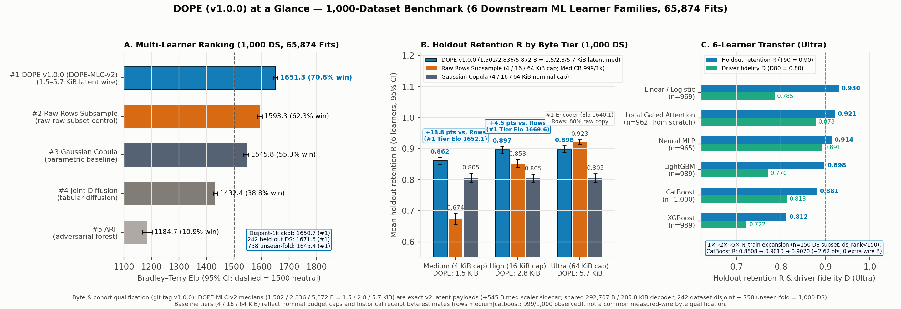
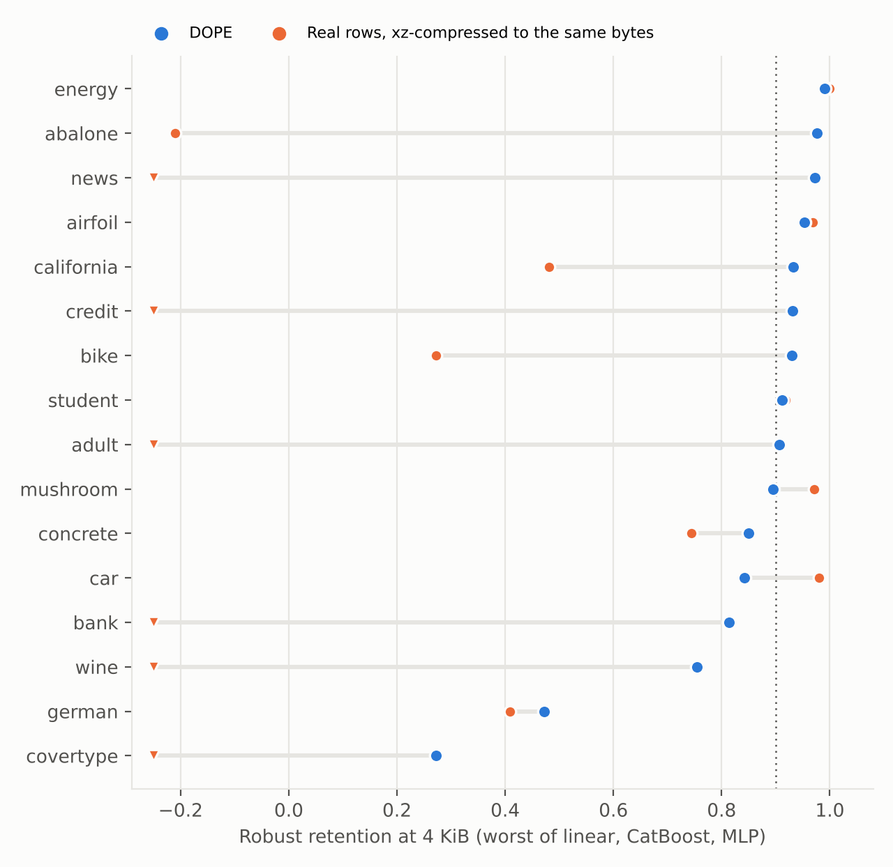
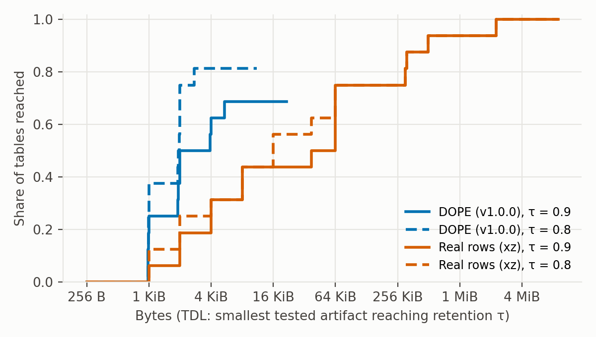
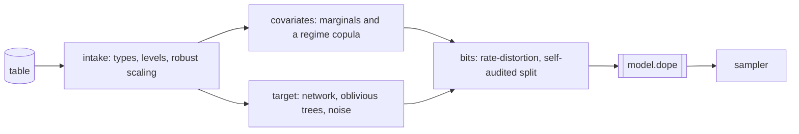
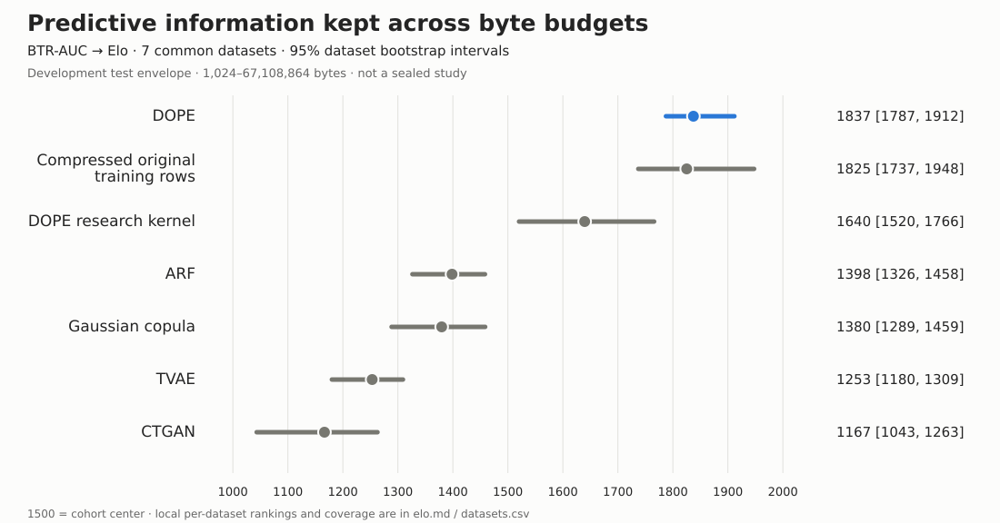

# D.O.P.E.: Downstream Objective-Preserving Encoding

**Compile a table into a tiny generative program that keeps what models learn from it.**

[](https://github.com/neverhuman/dope/actions/workflows/ci.yml)
[](https://github.com/neverhuman/dope/actions/workflows/jankurai.yml)
[](LICENSE)
[](engine/)

The score snapshot is checked against each fresh full-audit CI report; click it for current run status.



DOPE reads a table and writes a few-kilobyte **program**: a standard
[safetensors](https://github.com/huggingface/safetensors) file that holds each column's
distribution, how the columns move together, and a compact model of the target. It stores no
rows. Train a model only on rows sampled from the program, test it on held-out *real* rows,
and on most public tables it keeps most of what the same model learns from the real table.

- **Small.** A program is a few kilobytes, tens to hundreds of times smaller than the
  SDV Gaussian copula, TVAE, CTGAN and ARF generators at their default settings.
- **Keeps what models learn.** Models trained only on its samples keep most of the predictive
  gain of models trained on the real rows, measured for the worst of three model families.
- **Beats shipping the rows at small budgets.** At the smallest budgets its samples train
  better models than the real rows compressed with `xz` to the same bytes, on most tables.
  As the budget grows, the compressed rows catch up and then win.
- **One number to chase: TDL.** *Transfer Description Length* is the smallest tested
  artifact whose samples keep a target share of the predictive gain for every model family.
- **ML-ready output.** Categories become one-hot columns and numbers land on `[0, 1]` with
  outlier-robust scaling, or rows come back in original units and labels.
- **Pure Rust.** Fitting and sampling run on CPU. CUDA and Metal builds exist through
  [candle](https://github.com/huggingface/candle) but are not tested in CI. The artifact
  loads anywhere safetensors does.

Every number below comes from the benchmark records and is regenerated by a script; see
the table for the exact values and their intervals.

## Results

<!-- BEGIN DOPE1 RESULTS -->
<!-- Generated by bench/real-world/render.py from results/confirm/summary.json; do not edit. -->
Measured on 16 public tables (UCI and PMLB), held-out real test rows. Robust retention is the worst of three auditor families (linear/logistic, CatBoost, MLP) trained only on the method's rows; medians over tables with 95% bootstrap intervals.

| Method | Median bytes | Robust retention | Tables ≥ 0.9 |
|---|---:|---:|---:|
| DOPE, 2 KiB budget | 2.0 KiB | 0.905 [0.815, 0.939] | 8/16 |
| **DOPE, 4 KiB budget** | 3.8 KiB | 0.909 [0.843, 0.932] | 9/16 |
| DOPE, 16 KiB budget | 5.7 KiB | 0.933 [0.869, 0.965] | 10/16 |
| DOPE research kernel (`dope-kernel fit-table`) | 1.1 KiB | 0.677 [0.484, 0.844] | 3/16 |
| Real rows, xz-compressed to 4 KiB | 4.0 KiB | 0.340 [-4.012, 0.918] | 5/16 |
| Real rows, xz-compressed to 64 KiB | 50.8 KiB | 0.983 [0.950, 0.998] | 12/16 |
| Gaussian copula (SDV defaults) | 82.0 KiB | 0.282 [0.094, 0.447] | 1/16 |
| ARF (arfpy defaults) | 673.1 KiB | 0.705 [0.000, 0.856] | 3/16 |
| TVAE (SDV defaults) (7 tables) | 247.7 KiB | -0.460 [-1.361, 0.611] | 0/7 |
| CTGAN (SDV defaults) (7 tables) | 712.9 KiB | -1.897 [-3.060, -0.473] | 0/7 |
| All real rows, xz-compressed (reference) | 52.2 KiB | 0.999 [0.996, 1.000] | 16/16 |

Transfer Description Length at τ = 0.9: DOPE reaches it on 11/16 tables (median 1.9 KiB); xz-compressed real rows reach it on 16/16 (median 50.8 KiB).
At equal bytes, wherever DOPE fits the budget, it beats xz-compressed real rows in 60 of 92 paired (table, budget) comparisons and loses 32 (wins/ties/losses by budget: 1 KiB 11/0/1, 2 KiB 14/0/2, 4 KiB 11/0/5, 8 KiB 10/0/6, 16 KiB 10/0/6, 64 KiB 4/0/12). DOPE could not fit within 1 KiB on 4 tables: the schema plus the leanest program alone exceeded that budget.
Against the repository's research kernel (median 1.1 KiB) on the 14 regression and binary tables it supports, DOPE's robust retention wins/ties/losses are at 1 KiB 9/0/5, Hodges–Lehmann +0.010 [-0.394, +0.126]; at 2 KiB 12/0/2, Hodges–Lehmann +0.166 [+0.047, +0.291]; at 4 KiB 11/0/3, Hodges–Lehmann +0.160 [+0.045, +0.306]. On the 2 multiclass tables the kernel refuses the target or fits its class codes as a regression; its row above counts them as measured.




<!-- END DOPE1 RESULTS -->

Protocol, datasets, baselines and every per-table record: [bench/real-world](bench/real-world/).
The engine's manuscript is [paper/dope1.tex](paper/dope1.tex) (`bash paper/build.sh`).

## Quick start

```bash
# Build the CLI (Rust toolchain from rustup; add --features cuda or metal for a GPU)
cargo install --locked --path engine/dope-cli

dope fit train.csv --target income -o model.dope        # compile (default budget 4 KiB) and self-audit
dope inspect model.dope                                  # what is stored, byte by byte
dope sample model.dope -n 10000 -o synthetic.csv        # original units and labels
dope sample model.dope -n 10000 --space ml -o ml.csv    # one-hot + [0,1], ML-ready
dope eval -m model.dope --train train.csv --test test.csv   # retention per model family
dope frontier --train train.csv --test test.csv -t income   # bytes vs retention, and TDL
```

`--budget 16k` buys a larger program; `--anonymize` replaces column names and labels
with positional codes; `--device cuda` runs on a GPU.

Choose `--size small|medium|large` for **2 / 4 / 16 KiB** caps, or set an exact
`--budget 12KiB --max-parameters 4000` to constrain both whole-file bytes and the
complete generator's scalar state. `--budget` overrides a preset; a larger cap offers
capacity, and lift is measured by evaluation. `dope inspect --json` reports both counts.

`dope fit-tiers train.csv -t income --dataset-id adult-v1 --source SOURCE_URL
--data-license CC-BY-4.0 --out target/adult-v1` trains all three sizes and writes
portable artifacts, checksums, a catalog and a model card for review before release.
Recipients can sample these **dataset-specific** pretrained generators immediately.
See [model sizes, pretrained releases and the large-scale study](docs/model-sizes-and-elo.md).

## Command-line recipes

The deployed `dope` application is **Rust end to end**: fitting, sampling, prediction,
encoding and built-in evaluation need no Python interpreter or libtorch. Python research
training and benchmark harnesses stay outside the deployment package.

```bash
# Bound both deployment size and complete-generator state; cap CPU parallelism.
dope --threads 8 fit train.csv --target price --task regression \
  --size large --budget 12KiB --max-parameters 4000 --seed 42 \
  --device cpu --out prices.dope --report fit.json

# One JSON object on stdout for shell scripts, services and agents.
dope --threads 4 fit train.csv -t price --size medium --json -o prices.dope
# Diagnostics identify the Rust runtime, backends, worker count and executable hash.
dope --threads 4 doctor --json

# Generate original-unit rows, or one-hot features and numbers on [0,1].
dope --threads 8 sample prices.dope -n 100000 --seed 42 --device cpu -o synthetic.csv
dope sample prices.dope -n 100000 --space ml --scaling unit -o ml-ready.csv
# Inference CSVs may contain just the input features; no target values are required.
dope predict prices.dope unlabelled.csv -o predictions.csv
dope encode real.csv --model prices.dope --scaling quantile -o encoded.csv

# Evaluate on held-out real rows and save a machine-readable receipt.
dope eval -m prices.dope --train train.csv --test test.csv \
  --auditors linear,gbdt,mlp --factor 4 --seed 42 --json evaluation.json
dope frontier --train train.csv --test test.csv -t price \
  --budgets 2KiB,4KiB,8KiB,16KiB --tau 0.9 --json frontier.json
dope --threads 8 throughput prices.dope -n 1000000 --repeats 3 --device cpu
```

| Control | Meaning |
|---|---|
| `--target`, `--task` | Explicit target name/index; optional regression/classification override |
| `--size`, `--budget` | 2/4/16 KiB preset or exact whole-file cap; explicit budget wins |
| `--max-parameters` | Additional hard cap on the full generator's versioned scalar count |
| `--threads` | Global CPU worker limit, 1–1024; accepted before or after a subcommand |
| `--device`, `--seed` | Compute backend and reproducible random seed |
| `fit --json`, `fit --report` | JSON stdout and/or a saved report; `--quiet` suppresses human output |
| `sample --space`, `--scaling` | Original-unit or ML-ready rows; unit or quantile scaling |

Use `dope --help` and `dope fit --help` for all parameters. The signed CPU release
supports `--device cpu` and `auto`; GPU variants require separate builds and qualification.

## Signed Rust deployment

The release workflow builds a **Linux x86-64 CPU binary**, tests every customer command
with an empty tool `PATH`, checks the Rust dependency closure, collects upstream notices,
and signs provenance for the exact binary and package hashes using GitHub/Sigstore.
Only versioned engine tags already on main can enter that signing job. Users
verify the expected repository, workflow, tag and source commit before executing the binary.

The workflow is introduced in this PR; these commands are a template for an engine release
once its signed draft has been reviewed and published:

```bash
release_tag=dope-engine-v1.0.0
gh release download "$release_tag" --repo neverhuman/dope --dir release
release_commit=$(gh api "repos/neverhuman/dope/commits/$release_tag" --jq .sha)
# Run from this source checkout; verification fails if either signature is absent.
bash scripts/verify-engine-release.sh release "$release_tag" "$release_commit"
install -Dm755 release/dope-linux-x86_64 "$HOME/.local/bin/dope"
install -Dm644 release/LICENSE "$HOME/.local/share/dope-engine/LICENSE"
install -Dm644 release/THIRD_PARTY_NOTICES "$HOME/.local/share/dope-engine/THIRD_PARTY_NOTICES"
"$HOME/.local/bin/dope" --threads 4 doctor --json
```

Signature verification uses GitHub CLI during installation; the installed application
needs only its binary and the chosen `.dope` model data. Source builds remain available
with `cargo install --locked --path engine/dope-cli`; a local build is unsigned until
it goes through the release signing workflow. [Release, verification and Python training boundaries](docs/signed-engine-release.md).

## Walkthrough: UCI Adult census income

A real public table (UCI Adult, `CC-BY-4.0`) with eight categorical columns and a binary
target, from download to retention. Reproduce it with
[`examples/adult/walkthrough.py`](examples/adult/walkthrough.py).

<!-- BEGIN DOPE1 WALKTHROUGH -->
<!-- Generated by examples/adult/walkthrough.py --record; do not edit. -->

```bash
python3 bench/real-world/datasets.py --panel confirm --only adult --out data
```

```bash
dope fit data/confirm/adult/train.csv --target income -o adult.dope
```

```text
compiled data/confirm/adult/train.csv -> adult.dope  (4,079 bytes, budget 4,096)
  task         classification · 20,000 rows × 13 features
  program      9 knots · factor8 dependence × 16 regime(s) · net 10→12 (bits w5 b4 β6 v7) · 106 trees of depth 4
  stored gain  0.504 of the null loss explained on held-out rows
  self-audit   robust retention 0.904 (linear and tree auditors trained on samples, scored on held-out training rows)
  drivers      relationship, marital_status, occupation, education, education_num, age
  time         18.1 s on cpu (2 threads)
```

```bash
dope inspect adult.dope
```

```text
adult.dope  4,079 bytes (3,975 brotli program + 104 safetensors framing)
  inflated, the program holds:
  metadata             2,054 bytes
  copula.loadings        104 bytes
  discrete.cum           210 bytes
  discrete.values         64 bytes
  features.missing        13 bytes
  forest               2,332 bytes
  marginal.atoms          24 bytes
  marginal.knots          28 bytes
  marginal.range          16 bytes
  net.codes              100 bytes
  net.params              20 bytes
  noise                    2 bytes
  regime.means           208 bytes
  regime.scales          208 bytes
  regime.weights          16 bytes
  schema.affine           40 bytes
  task         Classification, target `income`
  features     13
  dependence   factor8 × 16 regime(s)
  net          10 inputs → 12 hidden → 1 outputs
  trees        106 oblivious trees of depth 4 (6-bit leaves)
  rows stored  none
```

```bash
dope sample adult.dope -n 4 --seed 1
```

```text
age,workclass,education,education_num,marital_status,occupation,relationship,race,sex,capital_gain,capital_loss,hours_per_week,native_country,income
80,Private,HS-grad,9,Married-civ-spouse,,Husband,White,Male,5867,0,53,United-States,>50K
35,Private,Some-college,10,Never-married,Sales,Own-child,White,Female,0,0,40,United-States,<=50K
67,Private,7th-8th,7,Married-civ-spouse,,Husband,White,Male,0,0,56,United-States,>50K
35,,9th,3,Separated,Machine-op-inspct,Not-in-family,White,Male,0,0,20,Dominican-Republic,<=50K
```

```bash
dope sample adult.dope -n 3 --seed 1 --space ml   # selected columns of 107
```

```text
age,education_num,relationship=Wife,relationship=Husband,relationship=Not-in-family,relationship=Unmarried,relationship=Other-relative,relationship=Own-child,hours_per_week,…
1,0.5,0,1,0,0,0,0,0.600017,…
0.292759,0.571429,0,0,0,0,0,1,0.4375,…
0.826336,0.357143,0,1,0,0,0,0,0.64114,…
```

```bash
dope eval -m adult.dope --train data/confirm/adult/train.csv --test data/confirm/adult/test.csv
```

```text
retention on 6512 held-out real rows (classification task, artifact 4079 bytes, 50000 synthetic vs 20000 real training rows)
  auditor   null loss   real loss  synth loss  retention
  linear      0.55198     0.32922     0.33758      0.962
  gbdt        0.55198     0.28585     0.30165      0.941
  mlp         0.55198     0.32818     0.33364      0.976
  robust retention (min over families): 0.941
```
<!-- END DOPE1 WALKTHROUGH -->

## How it works


```mermaid
flowchart LR
  T[(table)] --> I[intake: types, levels, robust scaling]
  I --> C[covariates: marginals and a regime copula]
  I --> Y[target: network, oblivious trees, noise]
  C & Y --> Q[bits: rate-distortion, self-audited split]
  Q --> A[[model.dope]]
  A --> S[sampler]
```

- **Intake** infers types, orders categorical levels by their link to the target, pools rare
  levels, applies `log1p` to skewed counts and scales every number robustly onto `[0, 1]`.
- **Covariates.** Quantile functions on a normal-score grid, joined by a regime mixture of
  Gaussian copulas that reproduces every marginal exactly.
- **Target.** A residual tanh network for smooth structure, boosted byte-coded *oblivious
  trees* for thresholds and interactions, then calibrated noise or labels.
- **Bytes.** A measured rate–distortion search sets each tensor's bit depth; a *self-audit*
  (fast learners trained on samples, scored on held-out training rows) picks the split
  between dependence and target; schema and codes are stored as one brotli stream.

Details: [engine/README.md](engine/README.md) and the manuscript.

## The KPI: Transfer Description Length

Retention compares a model trained on synthetic rows with the same model trained on the
real rows, both scored on untouched real rows:
`R = (L_null − L_synthetic) / (L_null − L_real)`; the robust score keeps the worst model
family. **TDL** is the smallest tested artifact (`KiB@T90/D80`) whose samples recover
nine-tenths of the real-trained lift in every family (T90) and four-fifths of the
real-trained feature-attribution agreement (D80). The benchmark here measures T90; D80 is
specified and not yet measured ([docs/metric.md](docs/metric.md)).

**Why this KPI.** For learners that converge on the synthetic distribution, retention
under log-loss *is* the share of the predictive information `I(X;Y)` the program keeps
(under squared loss, the share of `Var E[Y|X]`). TDL then estimates, on a grid of tested budgets,
how many bytes a table's predictive information needs, and DOPE spends its bytes on the
target model first.

### Relative rankings across datasets

**Budgeted Transfer Retention (BTR-AUC)** scores robust retention across a fixed
log-byte grid. Elo then summarizes paired dataset wins, with a one-point BTR-AUC tie
margin and dataset bootstrap intervals. This is a diagnostic companion to TDL;
the current report uses a selection-exposed envelope of tested configurations.



**Compressed original training rows** (formerly “Real rows (xz)”) is the storage
baseline: keep as many randomly selected original training rows as fit in an
xz-compressed CSV at each byte budget. xz is ordinary lossless compression. The
retained rows train the same downstream models, evaluated on held-out real data;
a larger budget may fit the entire training table.

The [all-method report](bench/real-world/results/elo/elo.md) includes seven common
datasets; the [broader CPU-method report](bench/real-world/results/elo-cpu/elo.md)
includes sixteen. Each contains local Elo and KPI scores for every dataset and
alternative, with missing measurements explicit. The point estimates do not establish
a decisive lead where intervals overlap. [Protocol and reproduction](docs/model-sizes-and-elo.md#master-kpi-budgeted-transfer-retention-auc-version-1).

## Use a DOPE artifact from Python

Standard safetensors with one tensor, a brotli stream ([format](engine/README.md#the-artifact)):

```python
import json, brotli                      # pip install brotli safetensors
from safetensors.numpy import load_file

blob = brotli.decompress(load_file("model.dope")["dope"].tobytes())
n = int.from_bytes(blob[:4], "little")
program = json.loads(blob[4:4 + n])      # schema, structure, bit widths, section list
```

## Repository map

| Path | What it is |
| --- | --- |
| [`engine/`](engine/) | The DOPE engine: the `dope-core` library and the `dope` CLI built from `engine/dope-cli`, pure Rust |
| [`bench/real-world/`](bench/real-world/) | Public-table benchmark: datasets, baselines, auditors, records, figures |
| [`paper/`](paper/) | The engine manuscript (`dope1.tex`, current), the earlier TDL manuscript (`main.tex`), generated numbers |
| [`examples/`](examples/) | Walkthroughs (engine and kernel) and historical demos |
| [`rust/`](rust/), [`src/`](src/), [`research/`](research/) | Research kernel (`dope-kernel`), Python compatibility layer, equal-byte study, evidence |
| [`docs/`](docs/) | Metric, claims policy, architecture, audit and release notes |
| [`AGENTS.md`](AGENTS.md) | Contributor and agent entrypoint |

## Scope

All results here are selection-exposed development validation on public tables, measured on
CPU; none is a sealed TDL result, and the TDL driver gate is not part of them
(cross-model feature-driver preservation: not yet measured).

- Retention is measured on held-out real rows of public tables; your table may differ,
  so measure it with `dope eval` before relying on a program.
- Copy, membership and attribute checks are empirical diagnostics, not formal differential
  privacy and not HIPAA de-identification. An engine artifact keeps column names, category
  labels and quantiles unless you pass `--anonymize`; treat it as derived private data.
- Each program is conditioned on one declared target; other targets get their own program.

## Documentation

- **Paper:** [paper/dope1.tex](paper/dope1.tex) and its [supplement](paper/dope1-supplement.tex)
  describe this engine and the benchmark above (`bash paper/build.sh` builds the PDFs).
- **Rules:** [metric](docs/metric.md), [claims policy](docs/claims-policy.md),
  [benchmark](docs/benchmark.md) and [status](STATUS.md).
- **Engineering:** [AGENTS.md](AGENTS.md), [architecture](docs/architecture.md) and
  [testing](docs/testing.md).
- **History**, kept for provenance and not results of this engine:
  - [HISTORY.md](HISTORY.md): selection-exposed results of the research kernel and the v2 validation panel.
  - [paper/main.tex](paper/main.tex) and its [supplement](paper/supplement.tex): the earlier TDL and research-kernel manuscript.
  - [docs/whitepaper/dope-mfs.pdf](docs/whitepaper/dope-mfs.pdf): the frozen v2 paper.

## Citation

```bibtex
@misc{taylor2026dope,
  title  = {{D.O.P.E.}: Downstream Objective-Preserving Encoding -- Generative Compression of Predictive Structure},
  author = {Taylor, Jepson and Alexander, Alton},
  year   = {2026},
  note   = {NEVERHUMAN Research. Source and receipts: https://github.com/neverhuman/dope}
}
```

Licensed under [MIT](LICENSE); see [CITATION.cff](CITATION.cff).
