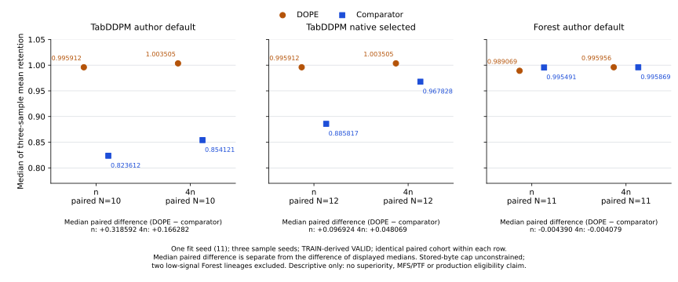

# Matched fit11 linear-regression figure



[Download the vector PDF](matched-linear-fit11.pdf). The figure renders the six authenticated public summaries in the [paired scalar panel](../matched-linear-fit11-retention-v1/README.md); it introduces no new fit, sampling or evaluation.

## Scope

Only regression with the shared linear auditor is compared. Each method uses fit seed **11** and three sample seeds (**101, 211, 307**), at **n** and **4n**, on official-TRAIN-derived **VALID**. Three sample retentions are averaged within each lineage; both method medians then use the same complete informative paired cohort. Cohort sizes are **10** for TabDDPM author default, **12** for TabDDPM native selected and **11** for Forest author default.

TabDDPM native selection retains its original author KPI: CatBoost validation R² averaged over synthetic sample seeds 0–4. Common linear outcomes selected nothing. Forest retains its original author-default configuration and fit11; its other fit seeds are not pooled. The shared linear regression constructor is seed-free. CatBoost/MLP common outcomes and other pilot/A952 diagnostics are excluded.

The separately labeled **median paired difference** is the median of within-lineage DOPE-minus-comparator differences. It is not the difference of the two displayed medians. Forest 4n illustrates this: medians 0.995956 and 0.995869 accompany a median paired difference of −0.004079. Two low-signal Forest lineages (`19f4780b53b3fa41`, `a04f964bc53281e0`) remain explicit exclusions in the scalar panel.

The comparison is unconstrained by the **10,240-byte** stored-artifact threshold. The scalar panel retains per-cell model-plus-projection charges and original comparator cap context. Stored bytes alone establish no production eligibility. **MFS-v2, PTF-v1, release-safe L3 and superiority remain null.** These descriptive medians establish no winner, fit variance, formal privacy or whole-runtime equivalence.

## Reproduction and custody

The SVG and PDF are exact copies of the corrected authenticated render; SVG trailing whitespace is normalized without changing plot content. `source-proof.json` and its closed schema bind the scalar input, metric provenance, renderer, artifacts, environment and actual rendering receipts without private paths. The renderer source is byte-identical to the source used for these artifacts.

The corrected render used Python 3.12.3, Matplotlib 3.6.3, NumPy 1.26.4, the Agg backend and DejaVu Sans. Vector metadata dates are fixed for reproducibility; they are not actual run timestamps. Source receipt clocks describe only local rendering, not method training or campaign cost. The corrected render reports no fresh RSS peak: its process inherited an earlier high-water mark. That value is not substituted for a measured rendering peak. Earlier renders and the user-site-version mismatch remain private historical evidence. Two correct-environment renders reproduced both vector hashes exactly.

First check the public scalar aggregation:

```sh
python3 -B -m research.benchmark.render_matched_linear_fit11 --check
```

With that pre-existing plotting environment, render into a fresh target directory (the renderer refuses existing output files):

```sh
mkdir -p target/matched-linear-fit11-figure-regeneration
CUDA_VISIBLE_DEVICES= PYTHONNOUSERSITE=1 MPLBACKEND=Agg OPENBLAS_NUM_THREADS=1 OMP_NUM_THREADS=1 \
python3 -B -m research.benchmark.render_matched_linear_fit11_figure \
  --panel research/benchmark/results/matched-linear-fit11-retention-v1/panel.json \
  --output-dir target/matched-linear-fit11-figure-regeneration
```

The source enforces a 768 MiB address-space limit. The caller's hard limit must allow that limit. It writes SVG/PDF and private preview/environment receipts under target; none contains new scientific measurements. No package installation or scientific input is required.

The cheap custody/input controls use only stdlib and public files; they do not import Matplotlib/NumPy or render:

```sh
python3 -B -m unittest research.benchmark.tests.test_matched_linear_fit11_figure -v
```
