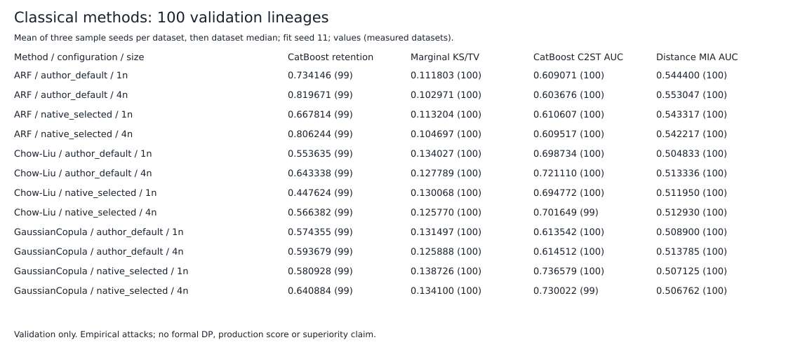
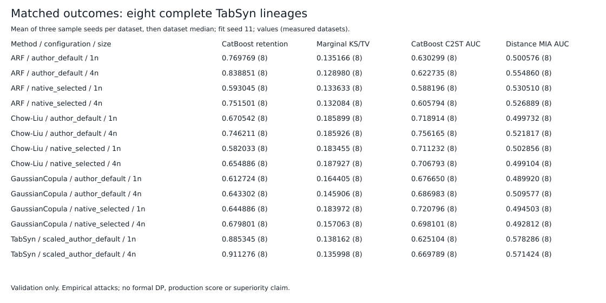

# Retained classical validation panels

Measured validation outcomes for **100 common S3 training-derived lineages**, plus a separate matched comparison on the **eight complete TabSyn lineages**. No official test was opened. These descriptive results do not certify production quality, privacy, or superiority.

## Coverage and provenance

- ARF: 1,116 distinct metric jobs cover 1,200 logical default/native-selected sample cells.
- GaussianCopula: 972 distinct metric jobs cover 1,200 logical cells.
- Chow-Liu: 1,050 distinct metric jobs cover 1,200 logical cells.
- TabSyn: 48 distinct jobs cover eight datasets, n/4n, and sample seeds 101/211/307. This is the completed scaled author-default cohort; no native-selected or 100-lineage TabSyn result is inferred.
- Every panel uses fit seed 11. Aliases preserve each logical configuration and its model-plus-projection byte charge; identical numeric samples are evaluated once. Alias counts are not independent repetitions.
- The density work reuses five prior A952 diagnostic outputs. Only their utility auditors were rerun at seed 1729 to match the other methods. The other 2,017 density diagnostic jobs are new.
- [panel.json](panel.json) maps all 3,648 logical cells to immutable input/alias/receipt hashes. [physical-metrics.jsonl](physical-metrics.jsonl) retains each of the 3,186 distinct diagnostic/utility records once, including per-column results, applicability reasons, fold AUCs and precision/recall curves. No original rows, field headers, model weights or sample payloads are published.

## Metrics

Marginals use per-column KS for continuous columns and TV for categorical columns. Dependence includes Pearson differences on eligible continuous pairs and categorical contingency TV; unavailable pair types remain explicit. Alpha-precision/beta-recall use the frozen unembedded A952 variant. Detection uses duplicate-group-separated five-fold CatBoost and logistic C2ST. Privacy records fit-versus-validation DCR, NNDR, distance membership attacks and the applicable KDE DOMIAS variant. These are empirical attacks, not a formal DP or de-identification claim.

Utility uses CatBoost, linear and MLP auditors on the same validation rows; retention is null-normalized TSTR versus TRTR. Uninformative real-data controls produce null retention. Baseline selection remains bound to the original native validation objective; none of these shared outcomes selects a configuration.

## Descriptive results

Each value is the median across datasets after averaging all three sample seeds within each dataset. A dataset contributes to a metric only when all three values exist. Counts and explicit missing outcomes are retained in JSON; no imputation or winner count is made.

| Method | Configuration | Size | CatBoost retention | Marginal KS/TV | CatBoost C2ST AUC | Distance MIA AUC |
|---|---|---:|---:|---:|---:|---:|
| ARF | author_default | 1n | 0.734146 (99) | 0.111803 (100) | 0.609071 (100) | 0.544400 (100) |
| ARF | author_default | 4n | 0.819671 (99) | 0.102971 (100) | 0.603676 (100) | 0.553047 (100) |
| ARF | native_selected | 1n | 0.667814 (99) | 0.113204 (100) | 0.610607 (100) | 0.543317 (100) |
| ARF | native_selected | 4n | 0.806244 (99) | 0.104697 (100) | 0.609517 (100) | 0.542217 (100) |
| Chow-Liu | author_default | 1n | 0.553635 (99) | 0.134027 (100) | 0.698734 (100) | 0.504833 (100) |
| Chow-Liu | author_default | 4n | 0.643338 (99) | 0.127789 (100) | 0.721110 (100) | 0.513336 (100) |
| Chow-Liu | native_selected | 1n | 0.447624 (99) | 0.130068 (100) | 0.694772 (100) | 0.511950 (100) |
| Chow-Liu | native_selected | 4n | 0.566382 (99) | 0.125770 (100) | 0.701649 (99) | 0.512930 (100) |
| GaussianCopula | author_default | 1n | 0.574355 (99) | 0.131497 (100) | 0.613542 (100) | 0.508900 (100) |
| GaussianCopula | author_default | 4n | 0.593679 (99) | 0.125888 (100) | 0.614512 (100) | 0.513785 (100) |
| GaussianCopula | native_selected | 1n | 0.580928 (99) | 0.138726 (100) | 0.736579 (100) | 0.507125 (100) |
| GaussianCopula | native_selected | 4n | 0.640884 (99) | 0.134100 (100) | 0.730022 (99) | 0.506762 (100) |

Numbers in parentheses are measured datasets. The CatBoost retention column has 99 informative datasets in each group. Most core diagnostics cover all 100; two native 4n C2ST groups have one unavailable dataset. DOMIAS and categorical-pair metrics have additional recorded applicability exclusions.





The eight-lineage figure compares methods only on those same eight inputs; it does not compare an eight-dataset neural median against a 100-dataset classical median. Real-data null/TRTR controls and TRAIN/validation/projection hashes match across all 100 classical lineages. The matched eight-lineage check includes TabSyn on those same inputs.

## Measured evaluation cost

| Operation | Distinct jobs | Numerical seconds | Peak RSS bytes |
|---|---:|---:|---:|
| ARF new diagnostics and utility | 1,116 | 1396.094902 | 768512000 |
| Copula/Chow new diagnostics and utility | 2,017 | 2239.001908 | 845471744 |
| Utility-only alignment for five retained diagnostics | 5 | 2.723124 | 297795584 |

These are metric-operation clocks, not generator-training costs or the earlier five diagnostic costs. Generation receipt clocks and selection/artifact inventories remain unchanged. Parent exit codes are unknown after transient-unit collection; complete locks and actual per-job receipts establish metric coverage. Numerical clocks exclude setup, hashing and transport. The CPU operations used disjoint pinned cores, nice 19, idle I/O, no CUDA, 4 GiB memory caps, no swap and a pre-job 15% free-RAM floor. No fit, sample generation or new tuning was performed by this publisher.

## Reproduction

Validate schemas, verify every scalar against the committed distinct metric record, and regenerate JSONL/CSV/SVG from committed data:

```bash
python3 -B -m unittest research.benchmark.tests.test_retained_comparison -v
```

To rebuild from private immutable metadata and original receipts, pass a hash-pinned configuration to `python3 -B -m research.benchmark.publish_retained_comparison`. Its values are recorded under `panel.json.input_refs`. The optional receipt mirror is only a transport location: receipt bytes and hashes must still match the original frozen locks. No real-data files are decoded by this publication step.

`MFS-v2`, `PTF-v1`, release-safe L3 and superiority remain null. Official tests remain sealed.
